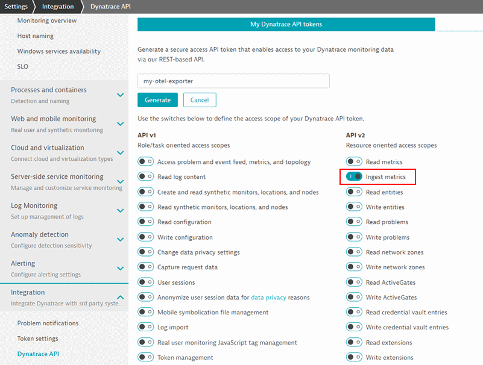

# Dynatrace OpenTelemetry Metrics Exporter for Go

> This exporter is based on the OpenTelemetry Metrics SDK for Go, which is currently in an alpha state and neither considered stable nor complete as of this writing.
> As such, this exporter is not intended for production use until the underlying OpenTelemetry Metrics API and SDK are stable.
> See [open-telemetry/opentelemetry-go](https://github.com/open-telemetry/opentelemetry-go) for the current state of the OpenTelemetry SDK for Go.
> 
## Getting started

The general setup of OpenTelemetry Go is explained in the official [Getting Started Guide](https://github.com/open-telemetry/opentelemetry-go/blob/master/README.md#getting-started).

A more detailed guide on metrics is expected to be added to the OpenTelemetry Go repository once the Metrics API and SDK are further developed.

The Dynatrace exporter is added and set up like this:

```go
  opts := dynatrace.Options{}
  if token, exists := os.LookupEnv("API_TOKEN"); exists {
    opts.APIToken = token
    opts.URL = os.Getenv("ENDPOINT")
  }

  exporter, err := dynatrace.NewExporter(opts)
  if err != nil{
    panic(err)
  }
  defer exporter.Close()

  processor := basic.New(
    simple.NewWithExactDistribution(),
    exporter,
  )

  pusher := push.New(
    processor,
    exporter,
  )
  pusher.Start()
  defer pusher.Stop()

  global.SetMeterProvider(pusher.MeterProvider())
  meter := global.Meter("otel.dynatrace.com/basic")
  vr := metric.Must(meter).NewFloat64ValueRecorder("otel.dynatrace.com.golang")
  vr.Record(context.Background(), 1.0)
```

A full setup is provided in our [example project](./example/basic/).

### Configuration

The exporter allows for configuring the following settings by setting them on the `dynatrace.Options` struct:

#### Dynatrace API Endpoint

The endpoint to which the metrics are sent is specified using the `URL` field.

Given an environment ID `myenv123` on Dynatrace SaaS, the [metrics ingest endpoint](https://www.dynatrace.com/support/help/dynatrace-api/environment-api/metric-v2/post-ingest-metrics/) would be `https://myenv123.live.dynatrace.com/api/v2/metrics/ingest`.

If a OneAgent is installed on the host, it can provide a local endpoint for providing metrics directly without the need for an API token.
This feature is currently in an Early Adopter phase and has to be enabled as described in the [OneAgent metric API documentation](https://www.dynatrace.com/support/help/how-to-use-dynatrace/metrics/metric-ingestion/ingestion-methods/local-api/).
Using the local API endpoint, the host ID and host name context are automatically added to each metric as dimensions.
The default metric API endpoint exposed by the OneAgent is `http://localhost:14499/metrics/ingest`.

#### Dynatrace API Token

The Dynatrace API token to be used by the exporter is specified using the `APIToken` field and could, for example, be read from an environment variable.

Creating an API token for your Dynatrace environment is described in the [Dynatrace API documentation](https://www.dynatrace.com/support/help/dynatrace-api/basics/dynatrace-api-authentication/).
The scope required for sending metrics is the `Ingest metrics` scope in the **API v2** section:



#### Metric Key Prefix

The `Prefix` field specifies an optional prefix, which is prepended to each metric key, separated by a dot (`<prefix>.<namespace>.<name>`).

#### Default Labels/Dimensions

The `DefaultDimensions` field can be used to optionally specify a list of key/value pairs, which will be added as additional labels/dimensions to all data points.

#### DisableDynatraceMetadataEnrichment

The `DisableDynatraceMetadataEnrichment` can be used to disable the Dynatrace metadata detection described below.

## Dynatrace Metadata Enrichment

If running on a host with a running OneAgent, the exporter will export metadata collected by the OneAgent to the Dynatrace endpoint.
This typically consists of the Dynatrace host ID and process group ID.
More information on the underlying feature used by the exporter can be found in the [Dynatrace documentation](https://www.dynatrace.com/support/help/how-to-use-dynatrace/metrics/metric-ingestion/ingestion-methods/enrich-metrics/).
If no Dynatrace API endpoint is set, the default exporter endpoint will be the OneAgent endpoint, and this option will be set automatically.
Therefore, if no endpoint is specified, a OneAgent is assumed to be running and exported to, including metadata.

Due to implementation details of the Go runtime and the OneAgent, it is currently not possible to read metadata on Unix/Linux systems,
therefore OneAgent enrichment for Go only functions on Windows hosts at this time.
